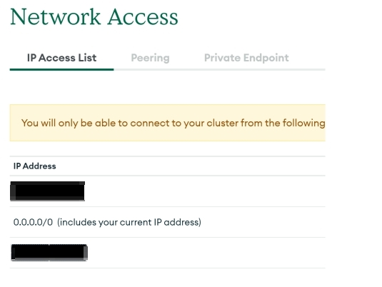

Backup from Cloud MongoDB Atlas
===

This action helps you to dump data from `Cloud MongoDB Atlas`, then you can continue to do whatever you want with the `/backups` data, such as packaging and uploading to gcs for backup.

## How to Use
Before using this action, make sure you have already created a db on Cloud MongoDB Atlas.  

## important :exclamation:
Ensure that your IP Address has permission to access your Cloud MongoDB Atlas. 

  
*You can use `0.0.0.0/0` to let all networks connect, but I do not recommend it.*

If it's a private cluster db, when starting your GitHub Action, you need to use your own runner ([self-hosted runners](https://docs.github.com/en/actions/hosting-your-own-runners/about-self-hosted-runners)), and make your own computer machine has a Static IP, then add this IP Address to your CLoud MongoDB's IP Access List, so you have permission to access your Cluster MongoDB.  

---

## Inputs

## `mongodb_uri`

**Required** Your cloud mongodb `uri`.  
**Can be a single uri or multiple uris separated by "," ex: "uri1,uri2"**  
**No spaces needed between the ","**

## Outputs

## `./backups` folder

The mongodb_uri will pass to the Docker container

## Example usage

```github action
- name: Backup MongoDB  
  uses: jim19901103/backup-mongo-action@master  
  with:
    mongodb_uri: ${{ secrets.CLOUD_MONGODB_URI }}
```

Then, you can continue to do whatever you want with the data, such as packaging and uploading to gcs for backup. Here is an example: 
```github action
- name: 'Tar files'
  run: tar -cvf TAR_NAME.tar ./backups
- id: 'dentall-cicd'
  name: Authenticate to Google Cloud
  uses: google-github-actions/auth@v0
    with:
      credentials_json: ${{ secrets.GCP_CREDENTIALS }}
- uses: google-github-actions/setup-gcloud@v0
- name: Storage to gcs
  run: |
    gcloud storage cp TAR_NAME.tar gs://GCS_BUCKET_PATH
```
